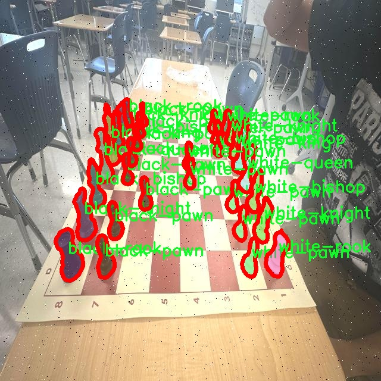
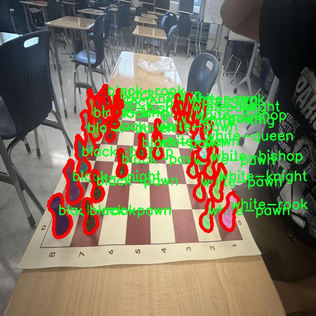

# 象棋棋盘棋子识别图像分割系统源码＆数据集分享
 [yolov8-seg-C2f-ContextGuided＆yolov8-seg-act等50+全套改进创新点发刊_一键训练教程_Web前端展示]

### 1.研究背景与意义

项目参考[ILSVRC ImageNet Large Scale Visual Recognition Challenge](https://gitee.com/YOLOv8_YOLOv11_Segmentation_Studio/projects)

项目来源[AAAI Global Al lnnovation Contest](https://kdocs.cn/l/cszuIiCKVNis)

研究背景与意义

随着人工智能技术的迅猛发展，计算机视觉领域的应用日益广泛，尤其是在图像识别和分割方面。象棋作为一种具有悠久历史和深厚文化底蕴的棋类游戏，其复杂的棋局变化和丰富的策略深受人们喜爱。近年来，随着智能设备的普及，基于计算机视觉的象棋棋盘及棋子识别系统逐渐成为研究热点。通过自动识别棋盘和棋子，不仅可以提升棋类游戏的互动性和趣味性，还能为棋类教育、棋局分析等领域提供强有力的技术支持。

在现有的图像识别技术中，YOLO（You Only Look Once）系列模型因其高效的实时检测能力而备受关注。YOLOv8作为该系列的最新版本，结合了深度学习和卷积神经网络的优势，能够在保持高精度的同时实现快速的目标检测。然而，针对象棋棋盘和棋子的特定需求，YOLOv8的标准模型在处理复杂背景、棋子重叠及遮挡等问题时仍存在一定的局限性。因此，基于改进YOLOv8的象棋棋盘棋子识别图像分割系统的研究具有重要的现实意义。

本研究的核心在于构建一个高效、准确的象棋棋盘和棋子识别系统。为此，我们利用了包含2100张图像的专用数据集，涵盖了13个类别的棋子，包括黑白双方的各类棋子及可能的障碍物。这一数据集的多样性为模型的训练提供了丰富的样本，能够有效提升模型的泛化能力和识别精度。此外，数据集中对不同棋子和棋盘的标注，使得模型在训练过程中能够学习到各类棋子的特征及其在棋盘上的空间关系，从而实现更为精确的图像分割。

在实际应用中，改进后的YOLOv8模型不仅能够快速识别棋盘和棋子，还能够在复杂环境中保持较高的识别率。这一系统的实现将为象棋爱好者提供更为便捷的棋局分析工具，帮助他们更好地理解和掌握棋局变化。同时，该系统还可应用于在线棋类对弈平台，为用户提供实时的棋局反馈和分析，提升用户体验。

此外，基于改进YOLOv8的象棋棋盘棋子识别图像分割系统的研究，具有重要的学术价值。通过对现有YOLO模型的改进和优化，研究者可以为计算机视觉领域提供新的思路和方法，推动相关技术的发展。同时，该研究也为后续的棋类游戏智能化提供了理论基础和实践经验，具有广泛的应用前景。

综上所述，基于改进YOLOv8的象棋棋盘棋子识别图像分割系统的研究，不仅具有重要的实际应用价值，也为计算机视觉技术的发展提供了新的方向。通过深入探讨该领域的关键问题，我们期望能够为象棋及其他棋类游戏的智能化发展贡献一份力量。

### 2.图片演示


##### 注意：由于此博客编辑较早，上面“2.图片演示”和“3.视频演示”展示的系统图片或者视频可能为老版本，新版本在老版本的基础上升级如下：（实际效果以升级的新版本为准）

  （1）适配了YOLOV8的“目标检测”模型和“实例分割”模型，通过加载相应的权重（.pt）文件即可自适应加载模型。

  （2）支持“图片识别”、“视频识别”、“摄像头实时识别”三种识别模式。

  （3）支持“图片识别”、“视频识别”、“摄像头实时识别”三种识别结果保存导出，解决手动导出（容易卡顿出现爆内存）存在的问题，识别完自动保存结果并导出到tempDir中。

  （4）支持Web前端系统中的标题、背景图等自定义修改，后面提供修改教程。

  另外本项目提供训练的数据集和训练教程,暂不提供权重文件（best.pt）,需要您按照教程进行训练后实现图片演示和Web前端界面演示的效果。

### 3.视频演示

[3.1 视频演示](https://www.bilibili.com/video/BV1CQmBYzEpP/)

### 4.数据集信息展示

##### 4.1 本项目数据集详细数据（类别数＆类别名）

nc: 13
names: ['black-bishop', 'black-king', 'black-knight', 'black-pawn', 'black-queen', 'black-rook', 'blockage', 'white-bishop', 'white-king', 'white-knight', 'white-pawn', 'white-queen', 'white-rook']


##### 4.2 本项目数据集信息介绍

数据集信息展示

在本研究中，我们构建了一个名为“Chess Board Recognition”的数据集，旨在为改进YOLOv8-seg的象棋棋盘棋子识别图像分割系统提供强有力的支持。该数据集包含13个类别，涵盖了象棋游戏中所有的棋子以及可能的干扰物体。这些类别分别是：黑色象、黑色国王、黑色骑士、黑色兵、黑色皇后、黑色车、阻碍物、白色象、白色国王、白色骑士、白色兵、白色皇后和白色车。通过精心设计的数据集，我们希望能够提升模型在复杂场景下的识别精度和分割效果。

在数据集的构建过程中，我们注重多样性和代表性，确保所收集的图像涵盖了不同的棋盘布局、光照条件和视角变化。这种多样性不仅有助于模型学习到更为丰富的特征，还能增强其在实际应用中的鲁棒性。每个类别的图像均经过精细标注，确保每个棋子的边界清晰可辨，从而为模型提供高质量的训练数据。

具体而言，黑色和白色棋子的类别设计反映了象棋的基本构成。黑色棋子包括黑色象、国王、骑士、兵、皇后和车，而白色棋子则同样包括其对应的棋子。这种分类不仅便于模型进行分类识别，也为后续的图像分割任务提供了明确的目标。阻碍物的加入则是为了模拟实际游戏中可能出现的干扰因素，进一步提高模型在复杂环境下的适应能力。

数据集的图像来源广泛，涵盖了不同风格和材质的棋盘与棋子，确保了模型在多种场景下的泛化能力。我们特别关注棋盘的布局和棋子的摆放，力求每一张图像都能真实反映出象棋游戏的实际情况。此外，数据集中还包含了多种不同的棋盘背景，进一步增加了模型的训练难度，促使其学习到更为细致的特征。

为了确保数据集的高质量，我们对图像进行了严格的筛选和预处理。每张图像都经过了去噪、增强和标准化处理，以提高模型的训练效率和效果。同时，我们也为每个类别提供了详细的描述和示例图像，方便研究人员和开发者理解数据集的构成和使用方法。

在模型训练过程中，我们将利用“Chess Board Recognition”数据集进行多轮实验，评估YOLOv8-seg在不同配置下的表现。通过不断调整模型参数和训练策略，我们期望能够实现更高的准确率和更好的分割效果，为象棋棋盘和棋子的自动识别提供强有力的技术支持。

总之，“Chess Board Recognition”数据集不仅为本研究提供了基础数据支撑，也为未来的象棋相关智能应用奠定了坚实的基础。我们相信，通过对该数据集的深入挖掘和研究，能够推动象棋图像识别技术的发展，促进人工智能在游戏领域的广泛应用。







### 5.全套项目环境部署视频教程（零基础手把手教学）

[5.1 环境部署教程链接（零基础手把手教学）](https://www.bilibili.com/video/BV1jG4Ve4E9t/?vd_source=bc9aec86d164b67a7004b996143742dc)


[5.2 安装Python虚拟环境创建和依赖库安装视频教程链接（零基础手把手教学）](https://www.bilibili.com/video/BV1nA4VeYEze/?vd_source=bc9aec86d164b67a7004b996143742dc)

### 6.手把手YOLOV8-seg训练视频教程（零基础小白有手就能学会）

[6.1 手把手YOLOV8-seg训练视频教程（零基础小白有手就能学会）](https://www.bilibili.com/video/BV1cA4VeYETe/?vd_source=bc9aec86d164b67a7004b996143742dc)


按照上面的训练视频教程链接加载项目提供的数据集，运行train.py即可开始训练



     Epoch   gpu_mem       box       obj       cls    labels  img_size
     1/200     0G   0.01576   0.01955  0.007536        22      1280: 100%|██████████| 849/849 [14:42<00:00,  1.04s/it]
               Class     Images     Labels          P          R     mAP@.5 mAP@.5:.95: 100%|██████████| 213/213 [01:14<00:00,  2.87it/s]
                 all       3395      17314      0.994      0.957      0.0957      0.0843

     Epoch   gpu_mem       box       obj       cls    labels  img_size
     2/200     0G   0.01578   0.01923  0.007006        22      1280: 100%|██████████| 849/849 [14:44<00:00,  1.04s/it]
               Class     Images     Labels          P          R     mAP@.5 mAP@.5:.95: 100%|██████████| 213/213 [01:12<00:00,  2.95it/s]
                 all       3395      17314      0.996      0.956      0.0957      0.0845

     Epoch   gpu_mem       box       obj       cls    labels  img_size
     3/200     0G   0.01561    0.0191  0.006895        27      1280: 100%|██████████| 849/849 [10:56<00:00,  1.29it/s]
               Class     Images     Labels          P          R     mAP@.5 mAP@.5:.95: 100%|███████   | 187/213 [00:52<00:00,  4.04it/s]
                 all       3395      17314      0.996      0.957      0.0957      0.0845


### 7.50+种全套YOLOV8-seg创新点代码加载调参视频教程（一键加载写好的改进模型的配置文件）

[7.1 50+种全套YOLOV8-seg创新点代码加载调参视频教程（一键加载写好的改进模型的配置文件）](https://www.bilibili.com/video/BV1Hw4VePEXv/?vd_source=bc9aec86d164b67a7004b996143742dc)

### 8.YOLOV8-seg图像分割算法原理

原始YOLOv8-seg算法原理

YOLOv8-seg算法是Ultralytics公司在2023年推出的YOLO系列中的最新版本，标志着目标检测和图像分割领域的一次重要进步。YOLOv8的设计理念围绕着快速、准确和易于使用的原则展开，旨在为各种计算机视觉任务提供高效的解决方案。相较于其前身YOLOv5、YOLOv6和YOLOv7，YOLOv8在网络结构、性能优化和算法灵活性等方面进行了多项重要改进，使其在目标检测和图像分割任务中表现出色。

YOLOv8的网络结构可以分为四个主要模块：输入端、主干网络、Neck部分和输出端。输入端的设计尤为关键，YOLOv8采用了640x640的默认输入图像尺寸，但在实际应用中，考虑到不同长宽比的图像，YOLOv8引入了自适应图片缩放的策略。这一策略通过将图像的长边按比例缩小到指定尺寸，然后对短边进行填充，旨在减少信息冗余，提高目标检测和推理的速度。此外，YOLOv8在训练阶段还采用了Mosaic数据增强技术，通过随机拼接四张不同的图像，增强模型的鲁棒性和泛化能力。值得注意的是，在训练的最后10个epoch中，YOLOv8会停止使用Mosaic增强，以避免对数据真实分布的破坏。

在主干网络部分，YOLOv8引入了C2F模块，替代了YOLOv5中的C3模块。C2F模块借鉴了YOLOv7中的ELAN设计思想，增加了更多的跳层连接，从而获取更丰富的梯度流信息。这种结构的改进不仅提高了模型的精度，还保证了轻量化，适合在资源受限的环境中运行。YOLOv8还保留了SPPF（Spatial Pyramid Pooling Fast）模块，以确保在不增加计算负担的情况下，继续提供高效的特征提取。

在Neck部分，YOLOv8同样进行了重要的结构调整，去除了YOLOv5中两次上采样之前的1x1卷积连接层，直接对主干网络不同阶段输出的特征进行上采样。这一变化使得特征融合更加高效，减少了计算复杂度，提升了模型的整体性能。

YOLOv8的输出端采用了Decoupled-Head结构，显著不同于YOLOv5的Coupled-Head结构。在YOLOv8中，检测和分类的卷积过程被解耦，输入特征图经过两个1x1卷积模块分别进行类别预测和边界框位置预测。这种设计使得分类和定位任务可以独立优化，从而提高了模型的收敛速度和预测精度。此外，YOLOv8抛弃了传统的Anchor-Based方法，转而采用Anchor-Free策略。这一策略将目标检测转化为关键点检测，消除了对预设Anchor的依赖，使得模型在处理不同尺寸和形状的目标时更加灵活，提升了检测精度。

在损失函数的设计上，YOLOv8引入了Distribution Focal Loss（DFL）和Complete Intersection over Union Loss（CIoU）相结合的方式，旨在快速聚焦于标签附近的数值，提高模型的定位精度。分类分支中依然采用Binary Cross Entropy Loss（BCELoss），而边界框回归分支则通过DFL和CIoU的结合，确保模型在训练过程中能够有效地学习到目标的空间分布特征。

总的来说，YOLOv8-seg算法在多个方面进行了创新和优化，特别是在网络结构的灵活性和性能提升上表现突出。其自适应的输入处理、轻量化的主干网络、简化的特征融合方式以及解耦的输出结构，使得YOLOv8在目标检测和图像分割任务中具备了更高的效率和准确性。通过这些改进，YOLOv8不仅能够处理常规的目标检测任务，还能够有效地应对复杂场景下的图像分割需求，展现出其广泛的应用潜力和研究价值。随着YOLOv8的推广和应用，预计将在自动驾驶、安防监控、医疗影像分析等多个领域发挥重要作用，为计算机视觉技术的发展注入新的活力。


### 9.系统功能展示（检测对象为举例，实际内容以本项目数据集为准）

图9.1.系统支持检测结果表格显示

  图9.2.系统支持置信度和IOU阈值手动调节

  图9.3.系统支持自定义加载权重文件best.pt(需要你通过步骤5中训练获得)

  图9.4.系统支持摄像头实时识别

  图9.5.系统支持图片识别

  图9.6.系统支持视频识别

  图9.7.系统支持识别结果文件自动保存

  图9.8.系统支持Excel导出检测结果数据


### 10.50+种全套YOLOV8-seg创新点原理讲解（非科班也可以轻松写刊发刊，V11版本正在科研待更新）

#### 10.1 由于篇幅限制，每个创新点的具体原理讲解就不一一展开，具体见下列网址中的创新点对应子项目的技术原理博客网址【Blog】：


[10.1 50+种全套YOLOV8-seg创新点原理讲解链接](https://gitee.com/qunmasj/good)

#### 10.2 部分改进模块原理讲解(完整的改进原理见上图和技术博客链接)【如果此小节的图加载失败可以通过CSDN或者Github搜索该博客的标题访问原始博客，原始博客图片显示正常】
### YOLOv8简介
目前YOLO系列的SOTA模型是ultralytics公司于2023年发布的YOLOv8.按照模型宽度和深度不同分为YOLOv8n、YOLOv8s、YOLOv8m、YOLOv81、YOLOv8x五个版本。本文改进的是 YOLOv8n模型。
YOLOv8的 Backbone采用CSPDarknet结构，它是 Darknet 的一种改进，引入CSP改善网络结构。CSPDarknet把特征图分为两部分，一部分进行卷积操作，另一部分进行跳跃连接，在保持网络深度的同时减少参数量和计算量，提高网络效率。Neck 部分采用特征金字塔PANet[17]，通过自顶向下路径结合和自底向上特征传播进行多尺度融合。损失函数采用了CIloU[18]。YOLOv8的网络结构如图所示。


### ParC融合位置感知循环卷积简介
ParC：Position aware circular convolution


#### Position aware circular convolution
针对于全局信息的提取作者提出了Position aware circular convolution（也称作Global Circular Convolution）。图中左右实际是对于该操作水平竖直两方向的对称，理解时只看左边即可。对于维度为C*H*W的输入，作者先将维度为C*B*1的Position Embedding通过双线性插值函数F调整到适合input的维度C*H*1（以适应不同特征大小输入），并且将PE水平复制扩展到C*H*W维度与输入特征相加。这里作者将PE直接设置成为了可学习的参数。

接下来参考该博客将加入PE的特征图竖直方向堆叠，并且同样以插值的方式得到了适应输入维度的C*H*1大小的卷积核，进行卷积操作。对于这一步卷积，作者将之称为循环卷积，并给出了一个卷积示意图。


但个人感觉实际上这个示意图只是为了说明为什么叫循环卷积，对于具体的计算细节还是根据公式理解更好。


进一步，作者给出了这一步的伪代码来便于读者对这一卷积的理解：y=F.conv2D（torch.cat（xp，xp，dim=2），kV），实际上就是将xp堆叠之后使用了一个“条形（或柱形）”卷积核进行简单的卷积操作。（但这样会导致多一次重复卷积，因此在堆叠示意图中只取了前2*H-1行）

可以看到在示意图中特征维度变化如下：C*(2H-1)*W ---C*H*1--->C*H*W，作者特意带上了通道数，并且并没有出现通道数的改变，那么这里所进行的卷积应该是depth wise卷积，通过对文章后续以及论文源码的阅读可以得知这一步进行的就是DW卷积。（we introduce group convolution and point wise convolution into these modules, which decreases number of parameters without hurting performance.）


由groups = channel可知使用的是DW卷积
通过上面就完成了一次竖直方向的全局信息交流，同样只要在水平方向进行同样的操作即可做到水平方向的全局信息交流。

#### ParC block

通过ParC成功解决了全局信息提取的问题，接下来就是针对2）3）两点进行改进。首先是Meta-Former模块，Meta-Former由Token Mixer和Channel Mixer构成，ParC首先满足了Token Mixer的全局信息提取的要求，并且相较于Attention在计算成本上更低。


这里①中的PWC即point wise conv，进一步验证了我们前面对于深度可分离卷积的想法，而GCC-H/V即是前面所说的ParC-H/V。

①构建了Meta-Former中的Token mixer模块，那么最后剩下的问题就是3），替换掉Attention模块之后模型不再data driven。为了解决这一点作者给出了一个channel wise attention，先将特征图（x,C*H*W）进行global average（a,C*1*1）并输入一个MLP生成一个channel wise的权重（w,C*1*1），再将权重与特征图在通道方向相乘得到输出（output = wx,C*H*W）。

#### ParC net
对于ParC net 的搭建，作者直接基于MobileViT，采用了分叉结构（c）完成了网络的搭建。


具体而言作者保留了MobileViT中浅层具有局部感受野的MobileNetV2结构，而将网络深层的ViT block替换成了ParC block，使网络变成了一个pure ConvNet。


### 11.项目核心源码讲解（再也不用担心看不懂代码逻辑）

#### 11.1 ultralytics\models\nas\predict.py

以下是经过精简和注释的核心代码部分：

```python
# 导入必要的库
import torch
from ultralytics.engine.predictor import BasePredictor
from ultralytics.engine.results import Results
from ultralytics.utils import ops

class NASPredictor(BasePredictor):
    """
    Ultralytics YOLO NAS预测器，用于目标检测。

    该类扩展了Ultralytics引擎中的`BasePredictor`，负责对YOLO NAS模型生成的原始预测结果进行后处理。
    它应用了非极大值抑制（NMS）和将边界框缩放到原始图像尺寸等操作。

    属性:
        args (Namespace): 包含各种后处理配置的命名空间。
    """

    def postprocess(self, preds_in, img, orig_imgs):
        """对预测结果进行后处理，并返回Results对象的列表。"""

        # 将预测框从xyxy格式转换为xywh格式，并合并类分数
        boxes = ops.xyxy2xywh(preds_in[0][0])  # 提取边界框
        preds = torch.cat((boxes, preds_in[0][1]), -1).permute(0, 2, 1)  # 合并边界框和类分数

        # 应用非极大值抑制，过滤掉重叠的框
        preds = ops.non_max_suppression(preds,
                                        self.args.conf,  # 置信度阈值
                                        self.args.iou,   # IOU阈值
                                        agnostic=self.args.agnostic_nms,  # 是否类别无关
                                        max_det=self.args.max_det,  # 最大检测数量
                                        classes=self.args.classes)  # 选择的类别

        # 如果输入图像不是列表，则将其转换为numpy数组
        if not isinstance(orig_imgs, list):
            orig_imgs = ops.convert_torch2numpy_batch(orig_imgs)

        results = []  # 存储结果的列表
        for i, pred in enumerate(preds):
            orig_img = orig_imgs[i]  # 获取原始图像
            # 将预测框缩放到原始图像的尺寸
            pred[:, :4] = ops.scale_boxes(img.shape[2:], pred[:, :4], orig_img.shape)
            img_path = self.batch[0][i]  # 获取图像路径
            # 创建Results对象并添加到结果列表中
            results.append(Results(orig_img, path=img_path, names=self.model.names, boxes=pred))
        
        return results  # 返回处理后的结果列表
```

### 代码说明：
1. **类定义**：`NASPredictor`类继承自`BasePredictor`，用于处理YOLO NAS模型的预测结果。
2. **postprocess方法**：该方法负责后处理原始预测结果，包括：
   - 将边界框格式从`xyxy`转换为`xywh`。
   - 合并边界框和类别分数。
   - 应用非极大值抑制（NMS）以去除重叠的边界框。
   - 将预测框缩放到原始图像的尺寸。
   - 返回包含处理结果的`Results`对象列表。

该文件是Ultralytics YOLO（You Only Look Once）模型中的一个预测模块，主要用于处理YOLO NAS（Neural Architecture Search）模型生成的原始预测结果。文件中定义了一个名为`NASPredictor`的类，该类继承自`BasePredictor`，负责对模型的输出进行后处理，以便于获取最终的检测结果。

在类的文档字符串中，首先说明了该类的功能，即对YOLO NAS模型生成的原始预测结果进行后处理。后处理的步骤包括应用非极大值抑制（Non-Maximum Suppression, NMS）和将边界框的坐标缩放回原始图像的尺寸。类中还定义了一个属性`args`，它是一个命名空间，包含了多种后处理的配置参数。

在使用示例中，首先导入了`NAS`类，然后创建了一个YOLO NAS模型的实例，并获取其预测器。接着，假设已经有了原始预测结果`raw_preds`、输入图像`img`和原始图像`orig_imgs`，通过调用`postprocess`方法对这些数据进行处理，最终得到处理后的结果。

该类通常不会被直接实例化，而是在`NAS`类内部使用。`postprocess`方法是该类的核心功能，接受三个参数：`preds_in`（原始预测结果）、`img`（输入图像）和`orig_imgs`（原始图像）。在方法内部，首先将预测框的坐标从xyxy格式转换为xywh格式，并将预测框与对应的类别分数合并。接着，调用`non_max_suppression`函数对合并后的预测结果进行非极大值抑制，以去除冗余的边界框。

在处理完预测结果后，方法会检查输入的原始图像是否为列表格式，如果不是，则将其转换为NumPy数组格式。接下来，方法会遍历每个预测结果，缩放边界框以适应原始图像的尺寸，并将结果存储在`Results`对象中，最后返回一个包含所有结果的列表。

总的来说，该文件的主要功能是对YOLO NAS模型的预测结果进行后处理，以便于用户获取清晰、准确的目标检测结果。

#### 11.2 ultralytics\models\utils\loss.py

以下是经过简化和注释的核心代码部分，主要保留了损失计算的核心逻辑：

```python
import torch
import torch.nn as nn
import torch.nn.functional as F
from ultralytics.utils.metrics import bbox_iou
from .ops import HungarianMatcher

class DETRLoss(nn.Module):
    """
    DETR (DEtection TRansformer) 损失类。该类计算并返回DETR目标检测模型的不同损失组件。
    包括分类损失、边界框损失、GIoU损失等。
    """

    def __init__(self, nc=80, loss_gain=None, aux_loss=True, use_fl=True, use_vfl=False):
        """
        初始化DETR损失函数。

        Args:
            nc (int): 类别数量。
            loss_gain (dict): 各损失组件的系数。
            aux_loss (bool): 是否计算辅助损失。
            use_fl (bool): 是否使用FocalLoss。
            use_vfl (bool): 是否使用VarifocalLoss。
        """
        super().__init__()
        if loss_gain is None:
            loss_gain = {'class': 1, 'bbox': 5, 'giou': 2}
        self.nc = nc  # 类别数量
        self.loss_gain = loss_gain  # 损失系数
        self.aux_loss = aux_loss  # 是否使用辅助损失
        self.matcher = HungarianMatcher(cost_gain={'class': 2, 'bbox': 5, 'giou': 2})  # 匹配器
        self.fl = FocalLoss() if use_fl else None  # Focal Loss
        self.vfl = VarifocalLoss() if use_vfl else None  # Varifocal Loss

    def _get_loss_class(self, pred_scores, targets, gt_scores, num_gts):
        """计算分类损失。"""
        bs, nq = pred_scores.shape[:2]  # 获取批次大小和查询数量
        one_hot = torch.zeros((bs, nq, self.nc + 1), dtype=torch.int64, device=targets.device)
        one_hot.scatter_(2, targets.unsqueeze(-1), 1)  # 生成one-hot编码
        one_hot = one_hot[..., :-1]  # 去掉最后一类

        gt_scores = gt_scores.view(bs, nq, 1) * one_hot  # 计算真实得分

        # 使用Focal Loss或Varifocal Loss计算损失
        if self.fl:
            if num_gts and self.vfl:
                loss_cls = self.vfl(pred_scores, gt_scores, one_hot)
            else:
                loss_cls = self.fl(pred_scores, one_hot.float())
            loss_cls /= max(num_gts, 1) / nq  # 标准化损失
        else:
            loss_cls = nn.BCEWithLogitsLoss(reduction='none')(pred_scores, gt_scores).mean(1).sum()  # 计算BCE损失

        return {'loss_class': loss_cls.squeeze() * self.loss_gain['class']}  # 返回分类损失

    def _get_loss_bbox(self, pred_bboxes, gt_bboxes):
        """计算边界框损失和GIoU损失。"""
        loss = {}
        if len(gt_bboxes) == 0:
            loss['loss_bbox'] = torch.tensor(0., device=self.device)
            loss['loss_giou'] = torch.tensor(0., device=self.device)
            return loss

        # 计算L1损失
        loss['loss_bbox'] = self.loss_gain['bbox'] * F.l1_loss(pred_bboxes, gt_bboxes, reduction='sum') / len(gt_bboxes)
        # 计算GIoU损失
        loss['loss_giou'] = 1.0 - bbox_iou(pred_bboxes, gt_bboxes, xywh=True, GIoU=True)
        loss['loss_giou'] = loss['loss_giou'].sum() / len(gt_bboxes)
        loss['loss_giou'] *= self.loss_gain['giou']
        return loss  # 返回边界框损失和GIoU损失

    def _get_loss(self, pred_bboxes, pred_scores, gt_bboxes, gt_cls):
        """获取所有损失。"""
        match_indices = self.matcher(pred_bboxes, pred_scores, gt_bboxes, gt_cls)  # 计算匹配索引
        idx, gt_idx = self._get_index(match_indices)  # 获取索引
        pred_bboxes, gt_bboxes = pred_bboxes[idx], gt_bboxes[gt_idx]  # 根据索引选择预测和真实边界框

        # 生成目标标签
        bs, nq = pred_scores.shape[:2]
        targets = torch.full((bs, nq), self.nc, device=pred_scores.device, dtype=gt_cls.dtype)
        targets[idx] = gt_cls[gt_idx]

        gt_scores = torch.zeros([bs, nq], device=pred_scores.device)
        if len(gt_bboxes):
            gt_scores[idx] = bbox_iou(pred_bboxes.detach(), gt_bboxes, xywh=True).squeeze(-1)

        # 计算分类损失和边界框损失
        loss = {}
        loss.update(self._get_loss_class(pred_scores, targets, gt_scores, len(gt_bboxes)))
        loss.update(self._get_loss_bbox(pred_bboxes, gt_bboxes))
        return loss  # 返回所有损失

    def forward(self, pred_bboxes, pred_scores, batch):
        """
        前向传播计算损失。

        Args:
            pred_bboxes (torch.Tensor): 预测的边界框。
            pred_scores (torch.Tensor): 预测的得分。
            batch (dict): 包含真实标签的字典。
        """
        gt_cls, gt_bboxes = batch['cls'], batch['bboxes']  # 获取真实类别和边界框
        total_loss = self._get_loss(pred_bboxes, pred_scores, gt_bboxes, gt_cls)  # 计算总损失
        return total_loss  # 返回总损失
```

### 代码说明：
1. **DETRLoss类**：该类负责计算DETR模型的损失，包括分类损失和边界框损失。
2. **初始化方法**：设置类别数量、损失系数、是否使用辅助损失、Focal Loss和Varifocal Loss等。
3. **_get_loss_class方法**：计算分类损失，使用one-hot编码和Focal Loss。
4. **_get_loss_bbox方法**：计算边界框损失和GIoU损失。
5. **_get_loss方法**：计算所有损失，包括分类损失和边界框损失。
6. **forward方法**：前向传播，计算模型的总损失。

以上是核心部分的代码和详细注释，保留了损失计算的主要逻辑。

这个程序文件定义了一个用于目标检测的损失计算类，主要是为DETR（DEtection TRansformer）模型和其变种RT-DETR（Real-Time DeepTracker）模型计算损失。文件中包含了两个主要的类：`DETRLoss`和`RTDETRDetectionLoss`。

`DETRLoss`类是主要的损失计算类，它继承自`nn.Module`。在初始化方法中，类接受多个参数，包括类别数量、损失增益系数、是否计算辅助损失、是否使用Focal Loss和Varifocal Loss等。类内部还定义了一些属性，例如用于匹配的`HungarianMatcher`对象，以及根据是否使用Focal Loss或Varifocal Loss来初始化的损失对象。

该类的核心功能是计算目标检测的不同损失组件，包括分类损失、边界框损失和GIoU（广义交并比）损失。具体来说，`_get_loss_class`方法计算分类损失，`_get_loss_bbox`方法计算边界框损失和GIoU损失。损失的计算过程涉及到对预测结果和真实标签的比较，使用了PyTorch的张量操作和损失函数。

此外，`_get_loss_aux`方法用于计算辅助损失，适用于多层解码器的情况。`_get_loss`方法整合了所有损失的计算，并在`forward`方法中被调用。`forward`方法是类的入口，接收预测的边界框和分数，以及包含真实标签的批量数据，最终返回总损失。

`RTDETRDetectionLoss`类是对`DETRLoss`的扩展，增加了对去噪训练损失的计算。它的`forward`方法除了计算标准的检测损失外，还检查是否提供了去噪的元数据，如果有，则计算去噪损失并将其添加到总损失中。

整体而言，这个文件实现了一个复杂的损失计算机制，适用于现代目标检测模型，能够处理多种损失类型，并支持辅助损失的计算，具有较高的灵活性和可扩展性。

#### 11.3 ultralytics\data\base.py

以下是经过简化并添加详细中文注释的核心代码部分：

```python
import glob
import os
from pathlib import Path
import cv2
import numpy as np
from torch.utils.data import Dataset

class BaseDataset(Dataset):
    """
    基础数据集类，用于加载和处理图像数据。

    参数:
        img_path (str): 图像文件夹的路径。
        imgsz (int, optional): 图像大小，默认为640。
        augment (bool, optional): 如果为True，则应用数据增强，默认为True。
        classes (list): 包含的类别列表，默认为None。
    """

    def __init__(self, img_path, imgsz=640, augment=True, classes=None):
        """使用给定的配置和选项初始化BaseDataset。"""
        super().__init__()
        self.img_path = img_path  # 图像路径
        self.imgsz = imgsz  # 图像大小
        self.augment = augment  # 是否进行数据增强
        self.im_files = self.get_img_files(self.img_path)  # 获取图像文件列表
        self.labels = self.get_labels()  # 获取标签数据
        self.update_labels(include_class=classes)  # 更新标签以仅包含指定类别
        self.ni = len(self.labels)  # 数据集中图像的数量

    def get_img_files(self, img_path):
        """读取图像文件。"""
        f = []  # 存储图像文件路径
        # 遍历图像路径
        for p in img_path if isinstance(img_path, list) else [img_path]:
            p = Path(p)  # 使用Path处理路径
            if p.is_dir():  # 如果是目录
                f += glob.glob(str(p / '**' / '*.*'), recursive=True)  # 获取目录下所有图像文件
            elif p.is_file():  # 如果是文件
                with open(p) as t:
                    t = t.read().strip().splitlines()  # 读取文件内容
                    parent = str(p.parent) + os.sep
                    f += [x.replace('./', parent) if x.startswith('./') else x for x in t]  # 替换路径
            else:
                raise FileNotFoundError(f'{p} 不存在')
        # 过滤出有效的图像文件
        im_files = sorted(x for x in f if x.split('.')[-1].lower() in IMG_FORMATS)
        assert im_files, f'没有在 {img_path} 中找到图像'
        return im_files

    def update_labels(self, include_class):
        """更新标签以仅包含指定类别（可选）。"""
        for i in range(len(self.labels)):
            if include_class is not None:
                cls = self.labels[i]['cls']
                bboxes = self.labels[i]['bboxes']
                # 仅保留指定类别的标签
                j = np.isin(cls, include_class)
                self.labels[i]['cls'] = cls[j]
                self.labels[i]['bboxes'] = bboxes[j]

    def load_image(self, i):
        """加载数据集中索引为 'i' 的图像，返回图像及其原始和调整后的尺寸。"""
        im = cv2.imread(self.im_files[i])  # 读取图像
        if im is None:
            raise FileNotFoundError(f'未找到图像 {self.im_files[i]}')
        # 调整图像大小
        im = cv2.resize(im, (self.imgsz, self.imgsz), interpolation=cv2.INTER_LINEAR)
        return im

    def __getitem__(self, index):
        """返回给定索引的图像和标签信息。"""
        label = self.labels[index]  # 获取标签
        label['img'] = self.load_image(index)  # 加载图像
        return label

    def __len__(self):
        """返回数据集中标签的数量。"""
        return len(self.labels)

    def get_labels(self):
        """用户可以自定义标签格式，这里返回标签的字典。"""
        raise NotImplementedError
```

### 代码说明：
1. **BaseDataset类**：这是一个基础数据集类，继承自`torch.utils.data.Dataset`，用于加载和处理图像数据。
2. **初始化方法**：在初始化时，接收图像路径、图像大小、是否进行数据增强和类别列表等参数，并调用相关方法获取图像文件和标签。
3. **get_img_files方法**：用于读取指定路径下的图像文件，支持目录和文件两种情况，并过滤出有效的图像文件。
4. **update_labels方法**：根据指定的类别更新标签，只保留所需类别的标签信息。
5. **load_image方法**：根据索引加载图像，并调整其大小为指定的图像大小。
6. **__getitem__和__len__方法**：分别用于获取指定索引的图像和标签信息，以及返回数据集的长度。
7. **get_labels方法**：这是一个未实现的方法，用户可以根据自己的需求自定义标签格式。

这个程序文件是一个用于加载和处理图像数据的基础数据集类，名为 `BaseDataset`，它是 `torch.utils.data.Dataset` 的子类，主要用于支持图像数据的读取、预处理和增强。类的构造函数接收多个参数，包括图像路径、图像大小、是否缓存、是否进行数据增强等。

在初始化过程中，类会读取指定路径下的图像文件，并将其存储在 `im_files` 列表中。它还会调用 `get_labels` 方法来获取图像的标签信息，并通过 `update_labels` 方法更新标签，以便只包含所需的类别。数据集的大小通过 `ni` 属性来表示，即图像的数量。

该类还支持缓存图像到内存或磁盘，以提高加载速度。具体实现中，如果选择将图像缓存到内存，类会检查可用内存是否足够，并根据需要决定是否进行缓存。缓存的图像会以 NumPy 格式存储，以便快速读取。

`load_image` 方法用于加载指定索引的图像，并根据需要进行调整大小。该方法会处理图像的长宽比，确保在保持图像比例的情况下将其调整到指定的大小。如果启用了数据增强，加载的图像会被存储在一个缓冲区中，以便在训练过程中使用。

`__getitem__` 方法是数据集的核心部分，返回给定索引的图像及其标签信息，并应用预定义的转换（如数据增强）。而 `__len__` 方法则返回数据集中标签的数量。

此外，类中还定义了一些方法，如 `build_transforms` 和 `get_labels`，这些方法留给用户自定义实现，以便根据具体需求进行数据增强和标签格式化。

总的来说，这个类提供了一个灵活的框架，用于处理图像数据集，支持多种配置选项，适用于深度学习模型的训练和评估。

#### 11.4 ultralytics\engine\trainer.py

以下是代码中最核心的部分，并附上详细的中文注释：

```python
class BaseTrainer:
    """
    BaseTrainer类是用于创建训练器的基类。

    属性:
        args (SimpleNamespace): 训练器的配置。
        model (nn.Module): 模型实例。
        device (torch.device): 用于训练的设备。
        trainset (torch.utils.data.Dataset): 训练数据集。
        testset (torch.utils.data.Dataset): 测试数据集。
        optimizer (torch.optim.Optimizer): 优化器实例。
        scheduler (torch.optim.lr_scheduler._LRScheduler): 学习率调度器。
    """

    def __init__(self, cfg=DEFAULT_CFG, overrides=None):
        """
        初始化BaseTrainer类。

        参数:
            cfg (str, optional): 配置文件的路径。默认为DEFAULT_CFG。
            overrides (dict, optional): 配置覆盖。默认为None。
        """
        self.args = get_cfg(cfg, overrides)  # 获取配置
        self.device = select_device(self.args.device, self.args.batch)  # 选择设备
        self.model = None  # 初始化模型
        self.trainset, self.testset = None, None  # 初始化训练和测试数据集
        self.optimizer = None  # 初始化优化器
        self.scheduler = None  # 初始化学习率调度器

    def train(self):
        """开始训练过程。"""
        world_size = len(self.args.device.split(',')) if isinstance(self.args.device, str) else 1  # 计算世界大小
        if world_size > 1:  # 如果是多GPU训练
            self._setup_ddp(world_size)  # 设置分布式数据并行
        self._setup_train(world_size)  # 设置训练

        for epoch in range(self.args.epochs):  # 遍历每个epoch
            self.model.train()  # 设置模型为训练模式
            for batch in self.train_loader:  # 遍历训练数据
                self.optimizer.zero_grad()  # 清空梯度
                loss = self.model(batch)  # 前向传播计算损失
                loss.backward()  # 反向传播计算梯度
                self.optimizer.step()  # 更新优化器
            self.scheduler.step()  # 更新学习率

    def _setup_train(self, world_size):
        """设置训练的相关参数和数据加载器。"""
        self.model = self.get_model()  # 获取模型
        self.train_loader = self.get_dataloader(self.trainset)  # 获取训练数据加载器
        self.optimizer = self.build_optimizer(self.model)  # 构建优化器
        self.scheduler = self.build_scheduler(self.optimizer)  # 构建学习率调度器

    def get_model(self):
        """加载或创建模型。"""
        # 这里可以添加模型加载的逻辑
        return model

    def get_dataloader(self, dataset):
        """返回数据加载器。"""
        # 这里可以添加数据加载器的构建逻辑
        return dataloader

    def build_optimizer(self, model):
        """构建优化器。"""
        return optim.Adam(model.parameters(), lr=self.args.lr)  # 使用Adam优化器

    def build_scheduler(self, optimizer):
        """构建学习率调度器。"""
        return optim.lr_scheduler.StepLR(optimizer, step_size=10, gamma=0.1)  # 每10个epoch将学习率乘以0.1
```

### 代码注释说明：
1. **类的定义**：`BaseTrainer`类是一个训练器的基类，包含了训练过程中的核心逻辑和属性。
2. **初始化方法**：在`__init__`方法中，配置、设备选择、模型、数据集、优化器和调度器等属性被初始化。
3. **训练方法**：`train`方法是训练的主入口，负责控制训练的流程，包括遍历每个epoch和每个batch。
4. **设置训练**：`_setup_train`方法负责设置模型、数据加载器、优化器和学习率调度器。
5. **模型和数据加载器**：`get_model`和`get_dataloader`方法用于加载模型和构建数据加载器。
6. **优化器和调度器**：`build_optimizer`和`build_scheduler`方法用于构建优化器和学习率调度器，使用Adam优化器和StepLR调度器。

这些核心部分构成了训练的基础框架，其他功能（如验证、回调等）可以在此基础上扩展。

这个程序文件 `ultralytics/engine/trainer.py` 是用于训练 YOLO（You Only Look Once）模型的基础类 `BaseTrainer` 的实现。它提供了训练模型所需的各种功能和配置选项。以下是对该文件的详细讲解。

文件首先导入了一些必要的库，包括数学运算、文件和时间处理、深度学习框架 PyTorch 及其相关模块，以及 Ultralytics 库中的一些工具函数和类。这些导入为后续的训练过程提供了基础。

`BaseTrainer` 类是训练过程的核心，包含多个属性和方法。它的构造函数 `__init__` 接受配置文件路径和覆盖参数，并通过 `get_cfg` 函数加载配置。接着，它会检查是否需要从上次训练的检查点恢复训练，并选择合适的设备（如 GPU 或 CPU）进行训练。

在初始化过程中，类会创建保存结果的目录，并设置模型和数据集。数据集的检查通过 `check_cls_dataset` 和 `check_det_dataset` 函数进行，确保数据集格式正确。接下来，类会初始化一些优化工具和训练指标，包括损失函数、学习率调度器等。

`add_callback` 和 `set_callback` 方法用于管理训练过程中的回调函数，这些回调函数可以在特定事件发生时执行自定义操作，比如记录日志或更新模型。

`train` 方法是训练的入口，首先根据设备数量判断是否使用分布式数据并行（DDP）进行训练。如果是，则生成相应的命令并通过子进程运行；否则，直接调用 `_do_train` 方法进行训练。

`_setup_ddp` 和 `_setup_train` 方法分别用于初始化分布式训练和设置训练所需的模型、数据加载器和优化器。在 `_setup_train` 中，模型的层可以根据需要进行冻结，以便在训练过程中不更新某些参数。该方法还会检查自动混合精度（AMP）的设置，以提高训练效率。

`_do_train` 方法是实际的训练循环。它会迭代指定的训练轮数，在每个轮次中，模型会进行前向传播、计算损失、反向传播并更新参数。训练过程中会记录每个批次的损失，并在每个轮次结束时进行验证。

在训练结束后，`save_model` 方法会保存模型的检查点，包括当前的最佳性能和训练参数。`validate` 方法则用于在验证集上评估模型性能，并更新最佳性能值。

文件中还定义了一些其他辅助方法，如 `build_optimizer` 用于构建优化器，`preprocess_batch` 用于处理输入数据，`final_eval` 用于在训练结束后进行最终评估等。

总的来说，这个文件实现了 YOLO 模型训练的基础框架，提供了灵活的配置选项和回调机制，以便用户根据需要进行自定义和扩展。

#### 11.5 ultralytics\utils\tal.py

以下是代码中最核心的部分，并附上详细的中文注释：

```python
import torch
import torch.nn as nn

def select_candidates_in_gts(xy_centers, gt_bboxes, eps=1e-9):
    """
    从真实框中选择正样本的锚点中心。

    参数:
        xy_centers (Tensor): 形状为(h*w, 2)的张量，表示锚点的中心坐标。
        gt_bboxes (Tensor): 形状为(b, n_boxes, 4)的张量，表示真实框的坐标。

    返回:
        (Tensor): 形状为(b, n_boxes, h*w)的张量，表示每个真实框中是否包含锚点中心。
    """
    n_anchors = xy_centers.shape[0]  # 锚点数量
    bs, n_boxes, _ = gt_bboxes.shape  # 批次大小和真实框数量
    lt, rb = gt_bboxes.view(-1, 1, 4).chunk(2, 2)  # 将真实框分为左上角和右下角
    bbox_deltas = torch.cat((xy_centers[None] - lt, rb - xy_centers[None]), dim=2).view(bs, n_boxes, n_anchors, -1)
    return bbox_deltas.amin(3).gt_(eps)  # 返回每个锚点是否在真实框内的布尔值

class TaskAlignedAssigner(nn.Module):
    """
    用于目标检测的任务对齐分配器。

    此类根据任务对齐度量将真实对象分配给锚点，该度量结合了分类和定位信息。

    属性:
        topk (int): 考虑的最佳候选数量。
        num_classes (int): 目标类别数量。
        alpha (float): 分类组件的alpha参数。
        beta (float): 定位组件的beta参数。
        eps (float): 防止除以零的小值。
    """

    def __init__(self, topk=13, num_classes=80, alpha=1.0, beta=6.0, eps=1e-9):
        """初始化任务对齐分配器对象，允许自定义超参数。"""
        super().__init__()
        self.topk = topk  # 选择的最佳候选数量
        self.num_classes = num_classes  # 类别数量
        self.bg_idx = num_classes  # 背景类别索引
        self.alpha = alpha  # 分类度量的权重
        self.beta = beta  # 定位度量的权重
        self.eps = eps  # 防止除零的常数

    @torch.no_grad()
    def forward(self, pd_scores, pd_bboxes, anc_points, gt_labels, gt_bboxes, mask_gt):
        """
        计算任务对齐分配。

        参数:
            pd_scores (Tensor): 形状为(bs, num_total_anchors, num_classes)的张量，表示锚点的预测分数。
            pd_bboxes (Tensor): 形状为(bs, num_total_anchors, 4)的张量，表示锚点的预测边界框。
            anc_points (Tensor): 形状为(num_total_anchors, 2)的张量，表示锚点的坐标。
            gt_labels (Tensor): 形状为(bs, n_max_boxes, 1)的张量，表示真实框的标签。
            gt_bboxes (Tensor): 形状为(bs, n_max_boxes, 4)的张量，表示真实框的坐标。
            mask_gt (Tensor): 形状为(bs, n_max_boxes, 1)的张量，表示真实框的有效性掩码。

        返回:
            target_labels (Tensor): 形状为(bs, num_total_anchors)的张量，表示目标标签。
            target_bboxes (Tensor): 形状为(bs, num_total_anchors, 4)的张量，表示目标边界框。
            target_scores (Tensor): 形状为(bs, num_total_anchors, num_classes)的张量，表示目标分数。
            fg_mask (Tensor): 形状为(bs, num_total_anchors)的布尔张量，表示前景锚点。
            target_gt_idx (Tensor): 形状为(bs, num_total_anchors)的张量，表示目标真实框索引。
        """
        self.bs = pd_scores.size(0)  # 批次大小
        self.n_max_boxes = gt_bboxes.size(1)  # 最大真实框数量

        if self.n_max_boxes == 0:  # 如果没有真实框
            device = gt_bboxes.device
            return (torch.full_like(pd_scores[..., 0], self.bg_idx).to(device), 
                    torch.zeros_like(pd_bboxes).to(device),
                    torch.zeros_like(pd_scores).to(device), 
                    torch.zeros_like(pd_scores[..., 0]).to(device),
                    torch.zeros_like(pd_scores[..., 0]).to(device))

        # 获取正样本掩码和对齐度量
        mask_pos, align_metric, overlaps = self.get_pos_mask(pd_scores, pd_bboxes, gt_labels, gt_bboxes, anc_points, mask_gt)

        # 选择具有最高重叠的真实框
        target_gt_idx, fg_mask, mask_pos = select_highest_overlaps(mask_pos, overlaps, self.n_max_boxes)

        # 获取目标标签、边界框和分数
        target_labels, target_bboxes, target_scores = self.get_targets(gt_labels, gt_bboxes, target_gt_idx, fg_mask)

        # 归一化对齐度量
        align_metric *= mask_pos
        pos_align_metrics = align_metric.amax(dim=-1, keepdim=True)  # 计算正样本的最大对齐度量
        pos_overlaps = (overlaps * mask_pos).amax(dim=-1, keepdim=True)  # 计算正样本的最大重叠
        norm_align_metric = (align_metric * pos_overlaps / (pos_align_metrics + self.eps)).amax(-2).unsqueeze(-1)
        target_scores = target_scores * norm_align_metric  # 更新目标分数

        return target_labels, target_bboxes, target_scores, fg_mask.bool(), target_gt_idx

    def get_pos_mask(self, pd_scores, pd_bboxes, gt_labels, gt_bboxes, anc_points, mask_gt):
        """获取正样本掩码，形状为(b, max_num_obj, h*w)。"""
        mask_in_gts = select_candidates_in_gts(anc_points, gt_bboxes)  # 选择在真实框内的锚点
        align_metric, overlaps = self.get_box_metrics(pd_scores, pd_bboxes, gt_labels, gt_bboxes, mask_in_gts * mask_gt)  # 计算对齐度量和重叠
        mask_topk = self.select_topk_candidates(align_metric, topk_mask=mask_gt.expand(-1, -1, self.topk).bool())  # 选择前k个候选
        mask_pos = mask_topk * mask_in_gts * mask_gt  # 合并所有掩码

        return mask_pos, align_metric, overlaps

    def get_box_metrics(self, pd_scores, pd_bboxes, gt_labels, gt_bboxes, mask_gt):
        """计算给定预测和真实边界框的对齐度量。"""
        na = pd_bboxes.shape[-2]  # 锚点数量
        mask_gt = mask_gt.bool()  # 转换为布尔类型
        overlaps = torch.zeros([self.bs, self.n_max_boxes, na], dtype=pd_bboxes.dtype, device=pd_bboxes.device)  # 初始化重叠矩阵
        bbox_scores = torch.zeros([self.bs, self.n_max_boxes, na], dtype=pd_scores.dtype, device=pd_scores.device)  # 初始化边界框分数矩阵

        ind = torch.zeros([2, self.bs, self.n_max_boxes], dtype=torch.long)  # 初始化索引矩阵
        ind[0] = torch.arange(end=self.bs).view(-1, 1).expand(-1, self.n_max_boxes)  # 批次索引
        ind[1] = gt_labels.squeeze(-1)  # 真实框标签索引
        bbox_scores[mask_gt] = pd_scores[ind[0], :, ind[1]][mask_gt]  # 获取每个锚点的分数

        # 计算重叠
        pd_boxes = pd_bboxes.unsqueeze(1).expand(-1, self.n_max_boxes, -1, -1)[mask_gt]  # 扩展预测边界框
        gt_boxes = gt_bboxes.unsqueeze(2).expand(-1, -1, na, -1)[mask_gt]  # 扩展真实边界框
        overlaps[mask_gt] = bbox_iou(gt_boxes, pd_boxes, xywh=False, CIoU=True).squeeze(-1).clamp_(0)  # 计算IoU并限制为非负值

        align_metric = bbox_scores.pow(self.alpha) * overlaps.pow(self.beta)  # 计算对齐度量
        return align_metric, overlaps

    def select_topk_candidates(self, metrics, largest=True, topk_mask=None):
        """
        根据给定的度量选择前k个候选。

        参数:
            metrics (Tensor): 形状为(b, max_num_obj, h*w)的张量，表示度量值。
            largest (bool): 如果为True，选择最大的值；否则，选择最小的值。
            topk_mask (Tensor): 可选的布尔张量，形状为(b, max_num_obj, topk)。

        返回:
            (Tensor): 形状为(b, max_num_obj, h*w)的张量，包含选择的前k个候选。
        """
        topk_metrics, topk_idxs = torch.topk(metrics, self.topk, dim=-1, largest=largest)  # 获取前k个度量和索引
        if topk_mask is None:
            topk_mask = (topk_metrics.max(-1, keepdim=True)[0] > self.eps).expand_as(topk_idxs)  # 生成掩码

        topk_idxs.masked_fill_(~topk_mask, 0)  # 用0填充无效索引

        count_tensor = torch.zeros(metrics.shape, dtype=torch.int8, device=topk_idxs.device)  # 初始化计数张量
        ones = torch.ones_like(topk_idxs[:, :, :1], dtype=torch.int8, device=topk_idxs.device)  # 生成全1张量
        for k in range(self.topk):
            count_tensor.scatter_add_(-1, topk_idxs[:, :, k:k + 1], ones)  # 更新计数张量

        count_tensor.masked_fill_(count_tensor > 1, 0)  # 过滤无效边界框
        return count_tensor.to(metrics.dtype)  # 返回计数张量

    def get_targets(self, gt_labels, gt_bboxes, target_gt_idx, fg_mask):
        """
        计算正样本锚点的目标标签、目标边界框和目标分数。

        参数:
            gt_labels (Tensor): 真实框标签，形状为(b, max_num_obj, 1)。
            gt_bboxes (Tensor): 真实框边界框，形状为(b, max_num_obj, 4)。
            target_gt_idx (Tensor): 正样本锚点的真实框索引，形状为(b, h*w)。
            fg_mask (Tensor): 布尔张量，形状为(b, h*w)，表示前景锚点。

        返回:
            (Tuple[Tensor, Tensor, Tensor]): 包含目标标签、目标边界框和目标分数的元组。
        """
        batch_ind = torch.arange(end=self.bs, dtype=torch.int64, device=gt_labels.device)[..., None]  # 批次索引
        target_gt_idx = target_gt_idx + batch_ind * self.n_max_boxes  # 计算目标真实框索引
        target_labels = gt_labels.long().flatten()[target_gt_idx]  # 获取目标标签

        target_bboxes = gt_bboxes.view(-1, 4)[target_gt_idx]  # 获取目标边界框
        target_labels.clamp_(0)  # 限制标签为非负值

        target_scores = torch.zeros((target_labels.shape[0], target_labels.shape[1], self.num_classes),
                                    dtype=torch.int64,
                                    device=target_labels.device)  # 初始化目标分数
        target_scores.scatter_(2, target_labels.unsqueeze(-1), 1)  # 更新目标分数

        fg_scores_mask = fg_mask[:, :, None].repeat(1, 1, self.num_classes)  # 扩展前景掩码
        target_scores = torch.where(fg_scores_mask > 0, target_scores, 0)  # 应用前景掩码

        return target_labels, target_bboxes, target_scores  # 返回目标标签、边界框和分数
```

这段代码主要实现了一个任务对齐的分配器，用于目标检测中将真实框与锚点进行匹配。它通过计算锚点与真实框之间的重叠度和对齐度量，选择最合适的锚点进行分配。

这个程序文件 `tal.py` 是 Ultralytics YOLO（You Only Look Once）目标检测框架的一部分，主要实现了一个任务对齐的分配器（TaskAlignedAssigner），用于将真实目标（ground truth）分配给锚框（anchor boxes）。以下是对文件中主要内容的说明。

首先，文件导入了必要的库，包括 PyTorch 和一些自定义的模块。`check_version` 用于检查 PyTorch 的版本，`bbox_iou` 和 `wasserstein_loss` 是用于计算边界框交并比和 Wasserstein 损失的函数。

文件中定义了几个函数和一个类。`select_candidates_in_gts` 函数用于选择在真实目标框内的锚框中心点，返回一个布尔张量，指示哪些锚框是有效的。`select_highest_overlaps` 函数则用于处理锚框与多个真实目标框重叠的情况，选择与每个锚框重叠度最高的真实目标框。

`TaskAlignedAssigner` 类是文件的核心部分。它继承自 `nn.Module`，并实现了一个前向传播方法 `forward`，用于计算任务对齐的分配。该方法接受预测的分数、边界框、锚点、真实标签和边界框等输入，并返回目标标签、目标边界框、目标分数、前景掩码和目标真实索引。

在 `forward` 方法中，首先检查是否有真实目标框。如果没有，则返回默认值。接着调用 `get_pos_mask` 方法获取正样本掩码、对齐度量和重叠度。然后通过 `select_highest_overlaps` 方法选择重叠度最高的真实目标框。接下来，调用 `get_targets` 方法计算目标标签、边界框和分数。

`get_pos_mask` 方法负责生成正样本掩码，计算对齐度量和重叠度。`get_box_metrics` 方法则计算预测边界框与真实边界框之间的对齐度量和重叠度。`select_topk_candidates` 方法根据给定的度量选择前 k 个候选框。

最后，`get_targets` 方法根据正样本的索引计算目标标签、边界框和分数。

此外，文件还定义了一些辅助函数，如 `make_anchors` 用于生成锚框，`dist2bbox` 和 `bbox2dist` 用于在锚框和边界框之间进行转换。

总体来说，这个文件实现了一个复杂的目标检测任务中的锚框分配机制，结合了分类和定位信息，以提高检测精度。

### 12.系统整体结构（节选）

### 程序整体功能和架构概括

该程序是 Ultralytics YOLO（You Only Look Once）目标检测框架的一部分，旨在提供一个高效、灵活的深度学习模型训练和推理环境。整体架构分为多个模块，每个模块负责特定的功能，包括模型预测、损失计算、数据处理、训练管理和任务对齐。

1. **模型预测**：负责处理模型的输出，进行后处理以获取最终的检测结果。
2. **损失计算**：实现了多种损失函数的计算，以便在训练过程中优化模型性能。
3. **数据处理**：提供了数据集的加载、预处理和增强功能，确保输入数据的质量和多样性。
4. **训练管理**：管理训练过程，包括模型的初始化、优化器设置、训练循环和验证。
5. **任务对齐**：实现了锚框与真实目标框的分配机制，以提高目标检测的精度。

### 文件功能整理表

| 文件路径                                       | 功能描述                                                                                     |
|----------------------------------------------|--------------------------------------------------------------------------------------------|
| `ultralytics/models/nas/predict.py`         | 实现 YOLO NAS 模型的预测后处理，负责将模型输出转换为最终的检测结果，包括非极大值抑制等。            |
| `ultralytics/models/utils/loss.py`          | 定义损失计算类，计算目标检测中的分类损失、边界框损失和 GIoU 损失，支持多种损失类型的计算。       |
| `ultralytics/data/base.py`                  | 提供基础数据集类，负责图像数据的加载、预处理和增强，支持缓存和自定义转换。                     |
| `ultralytics/engine/trainer.py`             | 实现训练管理类，负责模型的训练过程，包括数据加载、优化器设置、训练循环和验证。                  |
| `ultralytics/utils/tal.py`                  | 实现任务对齐分配器，负责将锚框与真实目标框进行分配，计算重叠度和对齐度量，以提高检测精度。         |

这个框架通过模块化设计，使得各个部分可以独立开发和测试，同时也便于用户根据需求进行自定义和扩展。

注意：由于此博客编辑较早，上面“11.项目核心源码讲解（再也不用担心看不懂代码逻辑）”中部分代码可能会优化升级，仅供参考学习，完整“训练源码”、“Web前端界面”和“50+种创新点源码”以“14.完整训练+Web前端界面+50+种创新点源码、数据集获取”的内容为准。

### 13.图片、视频、摄像头图像分割Demo(去除WebUI)代码

在这个博客小节中，我们将讨论如何在不使用WebUI的情况下，实现图像分割模型的使用。本项目代码已经优化整合，方便用户将分割功能嵌入自己的项目中。
核心功能包括图片、视频、摄像头图像的分割，ROI区域的轮廓提取、类别分类、周长计算、面积计算、圆度计算以及颜色提取等。
这些功能提供了良好的二次开发基础。

### 核心代码解读

以下是主要代码片段，我们会为每一块代码进行详细的批注解释：

```python
import random
import cv2
import numpy as np
from PIL import ImageFont, ImageDraw, Image
from hashlib import md5
from model import Web_Detector
from chinese_name_list import Label_list

# 根据名称生成颜色
def generate_color_based_on_name(name):
    ......

# 计算多边形面积
def calculate_polygon_area(points):
    return cv2.contourArea(points.astype(np.float32))

...
# 绘制中文标签
def draw_with_chinese(image, text, position, font_size=20, color=(255, 0, 0)):
    image_pil = Image.fromarray(cv2.cvtColor(image, cv2.COLOR_BGR2RGB))
    draw = ImageDraw.Draw(image_pil)
    font = ImageFont.truetype("simsun.ttc", font_size, encoding="unic")
    draw.text(position, text, font=font, fill=color)
    return cv2.cvtColor(np.array(image_pil), cv2.COLOR_RGB2BGR)

# 动态调整参数
def adjust_parameter(image_size, base_size=1000):
    max_size = max(image_size)
    return max_size / base_size

# 绘制检测结果
def draw_detections(image, info, alpha=0.2):
    name, bbox, conf, cls_id, mask = info['class_name'], info['bbox'], info['score'], info['class_id'], info['mask']
    adjust_param = adjust_parameter(image.shape[:2])
    spacing = int(20 * adjust_param)

    if mask is None:
        x1, y1, x2, y2 = bbox
        aim_frame_area = (x2 - x1) * (y2 - y1)
        cv2.rectangle(image, (x1, y1), (x2, y2), color=(0, 0, 255), thickness=int(3 * adjust_param))
        image = draw_with_chinese(image, name, (x1, y1 - int(30 * adjust_param)), font_size=int(35 * adjust_param))
        y_offset = int(50 * adjust_param)  # 类别名称上方绘制，其下方留出空间
    else:
        mask_points = np.concatenate(mask)
        aim_frame_area = calculate_polygon_area(mask_points)
        mask_color = generate_color_based_on_name(name)
        try:
            overlay = image.copy()
            cv2.fillPoly(overlay, [mask_points.astype(np.int32)], mask_color)
            image = cv2.addWeighted(overlay, 0.3, image, 0.7, 0)
            cv2.drawContours(image, [mask_points.astype(np.int32)], -1, (0, 0, 255), thickness=int(8 * adjust_param))

            # 计算面积、周长、圆度
            area = cv2.contourArea(mask_points.astype(np.int32))
            perimeter = cv2.arcLength(mask_points.astype(np.int32), True)
            ......

            # 计算色彩
            mask = np.zeros(image.shape[:2], dtype=np.uint8)
            cv2.drawContours(mask, [mask_points.astype(np.int32)], -1, 255, -1)
            color_points = cv2.findNonZero(mask)
            ......

            # 绘制类别名称
            x, y = np.min(mask_points, axis=0).astype(int)
            image = draw_with_chinese(image, name, (x, y - int(30 * adjust_param)), font_size=int(35 * adjust_param))
            y_offset = int(50 * adjust_param)

            # 绘制面积、周长、圆度和色彩值
            metrics = [("Area", area), ("Perimeter", perimeter), ("Circularity", circularity), ("Color", color_str)]
            for idx, (metric_name, metric_value) in enumerate(metrics):
                ......

    return image, aim_frame_area

# 处理每帧图像
def process_frame(model, image):
    pre_img = model.preprocess(image)
    pred = model.predict(pre_img)
    det = pred[0] if det is not None and len(det)
    if det:
        det_info = model.postprocess(pred)
        for info in det_info:
            image, _ = draw_detections(image, info)
    return image

if __name__ == "__main__":
    cls_name = Label_list
    model = Web_Detector()
    model.load_model("./weights/yolov8s-seg.pt")

    # 摄像头实时处理
    cap = cv2.VideoCapture(0)
    while cap.isOpened():
        ret, frame = cap.read()
        if not ret:
            break
        ......

    # 图片处理
    image_path = './icon/OIP.jpg'
    image = cv2.imread(image_path)
    if image is not None:
        processed_image = process_frame(model, image)
        ......

    # 视频处理
    video_path = ''  # 输入视频的路径
    cap = cv2.VideoCapture(video_path)
    while cap.isOpened():
        ret, frame = cap.read()
        ......
```


### 14.完整训练+Web前端界面+50+种创新点源码、数据集获取


# [下载链接：https://mbd.pub/o/bread/Z5WalJlw](https://mbd.pub/o/bread/Z5WalJlw)